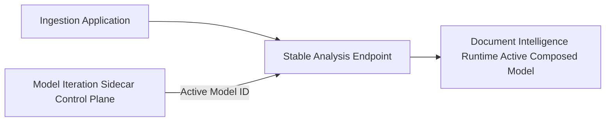
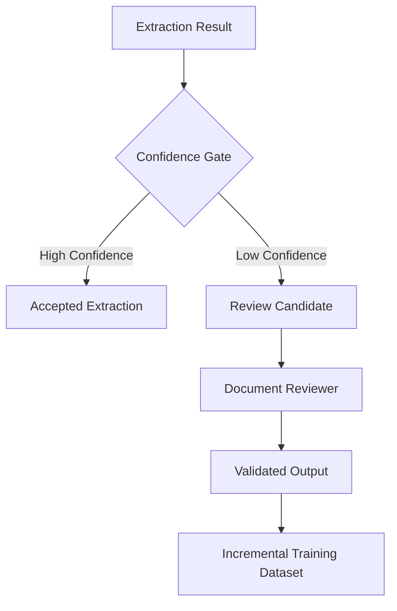
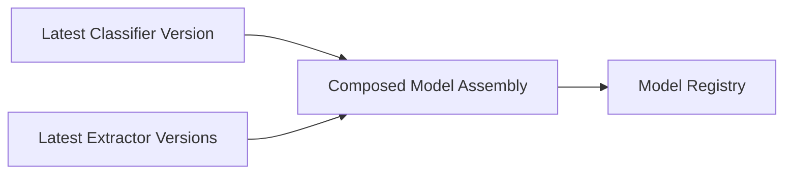

## MLOps for Azure Document Intelligence  
### Model Administration & Iteration Sidecar

This repository provides a **reference implementation of a model‑iteration sidecar** for **Azure AI Document Intelligence**, focused on orchestrating the **iterative lifecycle of custom document extraction systems** in real‑world enterprise environments.

It addresses the operational challenges that arise once document extraction systems move beyond a single model and must evolve safely over time.

---

## Table of Contents

- [Goals](#goals)
- [Project Diagrams](#project-diagrams)
- [Getting Started](#getting-started)
- [Contributing](#contributing)
- [Thank You](#thank-you)
- [Further reading](#further-reading)
- [License](#license)

---

## Goals

The goal of this project is to provide a **clear, opinionated reference** for operating Azure AI Document Intelligence systems **beyond the prototype phase**.

Specifically, this project aims to:

- Treat document extraction as an **iterative system**, not a one‑off training task
- Make low‑confidence extraction results **explicit and manageable**
- Introduce **Human‑in‑the‑Loop (HITL)** validation intentionally
- Build **incremental training datasets** over time
- Coordinate retraining across **independently evolving models**
- Assemble and promote **composed models** in a controlled way
- Decouple ingestion and business applications from model iteration

This repository focuses strictly on **control‑plane and orchestration logic**, not ingestion pipelines or user interfaces.

---

## Project Diagrams

### Architectural Role of the Sidecar

The model‑iteration sidecar acts as an **independent control plane**, deployed alongside ingestion systems but **decoupled from runtime inference**.

The ingestion system remains stable and version‑agnostic.  
All model evolution is coordinated through the sidecar.

---

### Confidence‑Based Review Workflow

Low‑confidence extraction results are routed out of the main ingestion path and tracked as **review candidates**, rather than blocking pipelines or silently polluting downstream systems.

This ensures failures are:
- Detected explicitly
- Reviewed intentionally
- Reused for iterative improvement

---

### Coordinated Model Retraining and Composition

Extractors, classifiers, and composed models evolve **independently**.  
The sidecar coordinates selective retraining and assembles new composed models from the **latest compatible versions**.

Promotion to production happens via indirection, enabling fast rollback without redeploying applications.

---

## Getting Started

This repository is a **reference implementation**, not a turnkey solution.

Typical usage involves:

1. Deploying the model‑iteration sidecar alongside an existing ingestion system
2. Emitting events to the sidecar when:
   - Confidence thresholds are breached
   - Review candidates are created
3. Using the sidecar to:
   - Track and manage review candidates
   - Curate incremental training datasets
   - Stage data for Azure Document Intelligence
   - Orchestrate retraining and composed model assembly
4. Promoting new composed models via registry‑based indirection

More detailed setup instructions may be added over time or provided in a dedicated `GETTING_STARTED.md`.

---

## Contributing

Contributions are welcome!

This project values:
- Clear architectural intent
- Explicit trade‑offs
- Incremental evolution over generic abstraction

Before proposing major changes, please open an issue to discuss scope and intent.

- See `CONTRIBUTING.md`
- See `CODE_OF_CONDUCT.md`

---

## Thank You

Thanks to the teams and communities behind:

- Azure AI Document Intelligence
- Open‑source MLOps practices and tooling
- The broader cloud architecture community for ongoing inspiration and feedback

---

## Further Reading

- *MLOps for Azure Document Intelligence: Orchestrating the Iterative Development of Custom Models*
- Azure AI Document Intelligence documentation
- Azure AI Content Understanding documentation
- General MLOps and model‑governance patterns

---

## License

This repository is covered under **The MIT License**.

See the `LICENSE` file for details.
