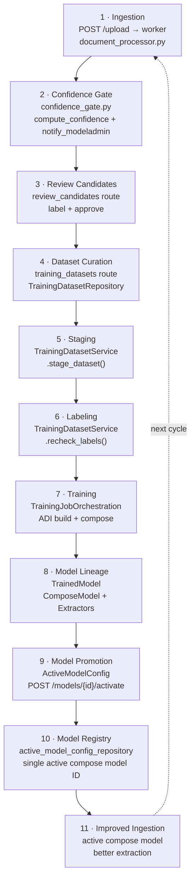
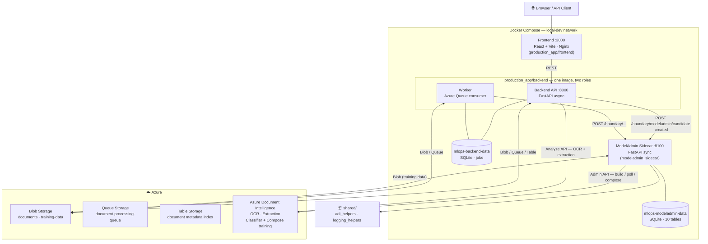
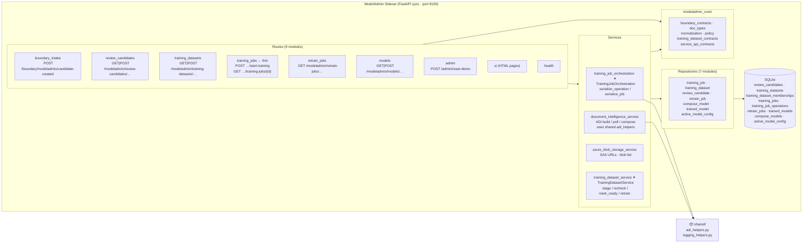
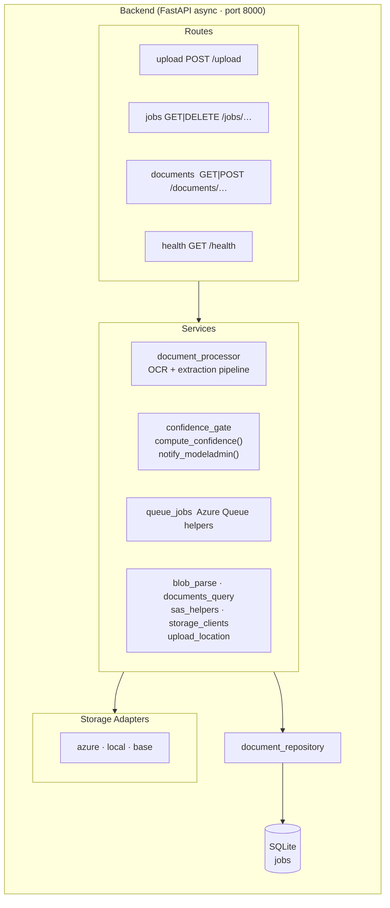
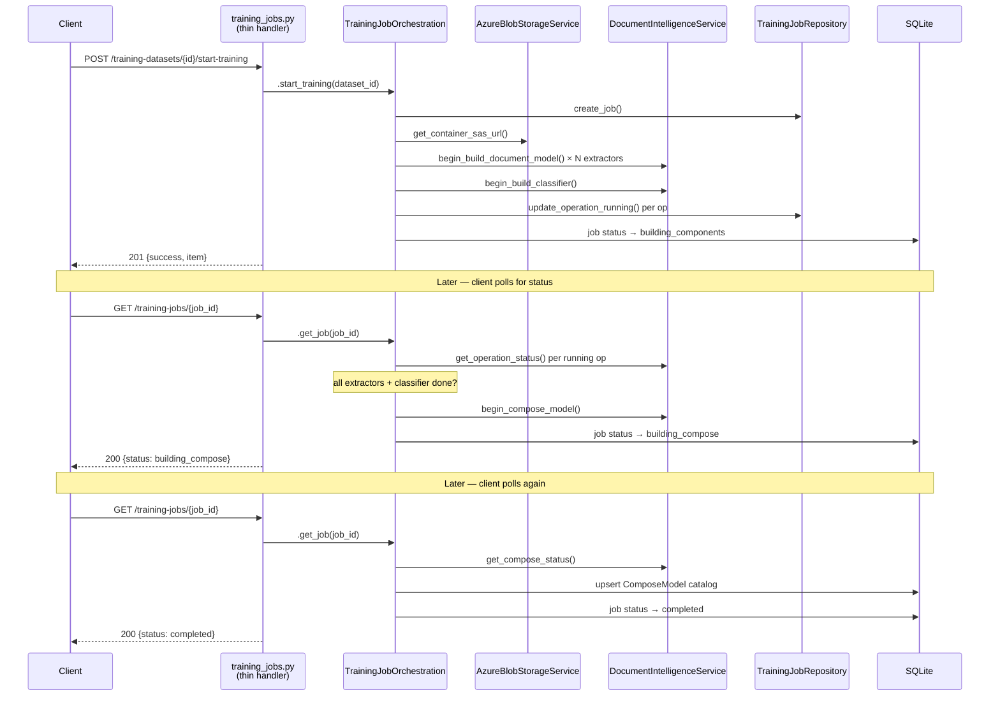
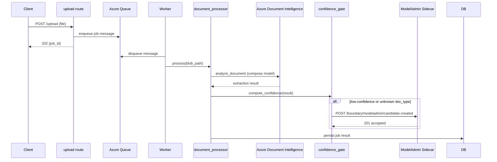
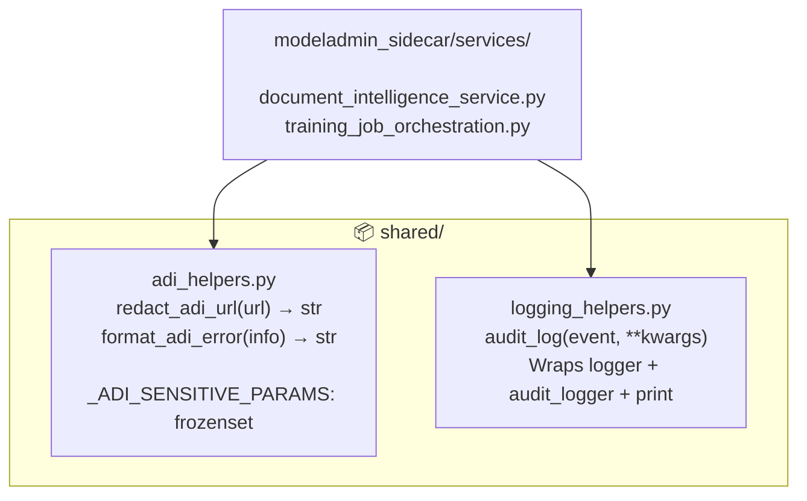
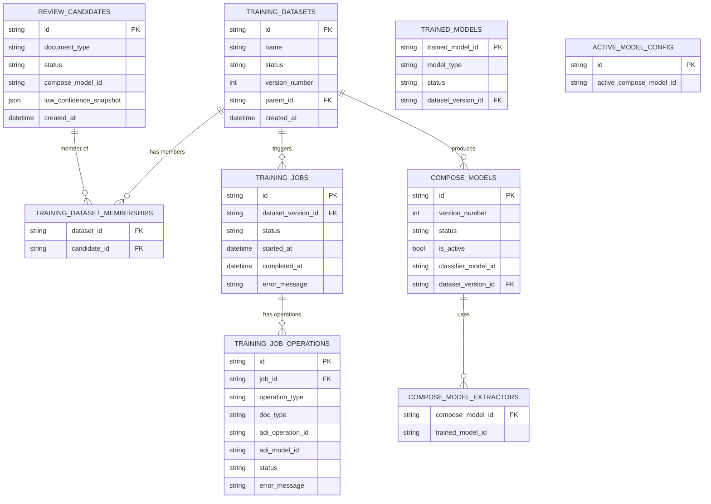

# FinOptPlatform — Architecture Reference

> Diagrams reflect the codebase as of Phase 4 simplification (May 2026).
> Rendered by GitHub Markdown, VS Code Markdown Preview (with Mermaid extension), and MkDocs.

---

## 0. Concept Pipeline

End-to-end lifecycle that the platform demonstrates. Each stage shows its concept role and the primary file or class that implements it.

> Stages 1–2 live in `production_app/backend`. Stages 3–11 live in `modeladmin_sidecar`.

### Stage-to-article mapping

| Stage | Article section | Primary source file(s) |
|-------|----------------|------------------------|
| 1 · Ingestion | "Document Ingestion: Upload, Queue, and Worker" | `production_app/backend/document_processor.py` |
| 2 · Confidence Gate | "Confidence Scoring and Triage" | `production_app/backend/confidence_gate.py` |
| 3 · Review Candidates | "Human-in-the-Loop (HITL): Labeling and Approval" | `modeladmin_sidecar/routes/review_candidates.py` |
| 4 · Dataset Curation | "Training Requirements: Curating the Dataset" | `modeladmin_sidecar/routes/training_datasets.py` |
| 5 · Staging | "Training Requirements: The Data Staging" | `modeladmin_sidecar/services/training_dataset_service.py` |
| 6 · Labeling | "Training Requirements: The Data Staging" | `modeladmin_sidecar/services/training_dataset_service.py` |
| 7 · Training | "Triggering a Training Job with ADI Custom Models" | `modeladmin_sidecar/services/training_job_orchestration.py` |
| 8 · Model Lineage | "Model Governance: Tracking Trained and Compose Models" | `modeladmin_sidecar/repositories/trained_model_repository.py`, `compose_model_repository.py` |
| 9 · Model Promotion | "Model Governance: Promoting a New Active Model" | `modeladmin_sidecar/routes/models.py` |
| 10 · Model Registry | "Model Governance: Promoting a New Active Model" | `modeladmin_sidecar/repositories/active_model_config_repository.py` |
| 11 · Improved Ingestion | "Closing the Loop: The Next Iteration" | `production_app/backend/confidence_gate.py` |

---

## 1. System Topology

Four Docker Compose services sharing a bridge network. All storage operations target real Azure services.

---

## 2. Internal Layer Architecture

### ModelAdmin Sidecar

### Backend API + Worker

---

## 3. Training Job Flow

End-to-end sequence from API call through ADI polling to compose model creation.

---

## 4. Document Processing Flow

---

## 5. Shared Package

`shared/` lives at the repo root and is importable by both services via `PYTHONPATH`.

---

## 6. Database Schema (ModelAdmin Sidecar)

